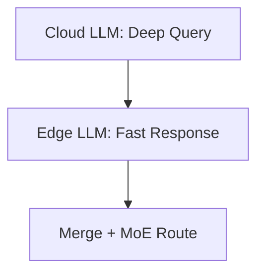
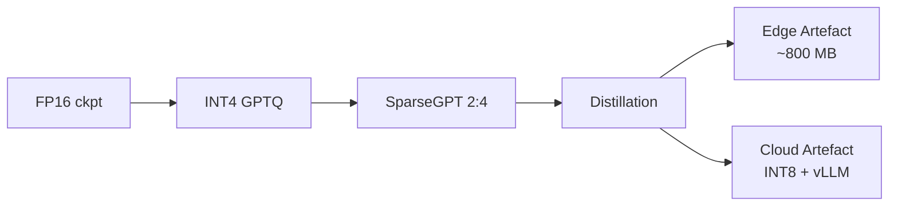

# 🧠 02 · Model Architecture — Reasoning Beyond Regression

> _“Our models don’t just learn sports—they reason through uncertainty, adapt to markets, and scale across verticals.”_

This document outlines the architectural design of VEGAIS Prediction Models, integrating signal-level pattern recognition with symbolic reasoning.

---

## 1  Design Philosophy

We architect our models for **generalised betting intelligence**, across games, odds formats, and shifting meta-strategies.

**Core Goals**:
- Temporal Awareness (long-range play development)
- Market Alignment (odds-resilient signals)
- Reasoning Capability (causal, counterfactual inference)

---

## 2  Model Overview

```mermaid
graph TD
    subgraph Core
        M[Mamba–Transformer Fusion]
        R[RL Fine-Tuning Loop]
        S[MoE Router]
        L[Logical Reasoning LLM]
        M --> R
        R --> S
        S --> L
    end
    L --> E[Prediction Head]
```



---

## 3  Modules Breakdown

| Module | Description |
|--------|-------------|
| **Mamba-Transformer** | Long-form sequence pattern extractor, low latency |
| **RL Loop (PPO)** | Feedback from ROI-based rewards during fine-tuning |
| **MoE Router** | Expert switching between domains (e.g., NBA vs. Premier League) |
| **LLM Layer** | Rule-based refinements, edge case handling, promptable |
| **Prediction Head** | Multi-task: classification + regression + confidence bands |

---

## 4  Promptability and Explanation

The LLM Reasoning Layer supports:
- **CoT**: Chain-of-thought for why predictions are made
- **Strategy Rationale**: Explains backing logic (e.g., injuries, momentum, odds drift)
- **Prompt-Driven Overrides**: Users can nudge or simulate “what if” scenarios

---

## 5  Inference Formulation

Let \( x \) be structured game context, \( \hat{y} = f_\theta(x) \) our model prediction.

We decompose as:

$$
f_\theta(x) = \text{LLM}(\text{MoE}(\text{RL}(\text{Mamba}(x))))
$$

Each output includes confidence band \( [p_{low}, p_{high}] \), scored via backtest and real-book odds range.

---

## 6  Fine-Tuning Strategies

| Tuning Type | Method | Use Case |
|-------------|--------|----------|
| Full Fine-Tune | SGD / AdamW | Initial training on new sport |
| LoRA / QLoRA | Efficient adapter updates | Continuous refresh |
| RLHF / DPO | Align predictions with economic return | Post-launch tuning |

---

## 7  Frameworks & Tooling

- **Transformer Base**: HuggingFace 🤗 / FlashAttention 2 / Mamba
- **RL Layer**: Ray RLlib, CleanRL PPO
- **LLM Reasoning**: GPTQ + OpenRouter API + vLLM fallback
- **Tracking**: Weights & Biases, MLflow, Optuna

---

## 8  Limitations and Mitigation

| Risk | Mitigation |
|------|------------|
| Overfit to bookmaker odds | Red-team fuzzing + odds-blind eval |
| Poor low-data sport generalisation | Cross-domain MoE + synthetic augmentation |
| Latency vs depth tradeoff | Multi-path distillation heads |

---

## References

1. “Mamba: Linear-Time SSMs”, NeurIPS 2023  
2. “FlashAttention-2”, Dao et al., arXiv 2023  
3. “DPO: Direct Preference Optimization”, Rafailov et al., 2023  
4. “LoRA: Low-Rank Adaptation”, Hu et al., ICLR 2022  
5. “Mixture-of-Experts Routing”, Google Brain, ICLR 2024  

---

> For architecture changes over time, see `/research_logs/model_versions.md`


---

## 9  Core Model Breakdown — PredictionEngine Stack

The architecture of our core prediction engine integrates four major components:

```text
" Mamba–Transformer Fusion Model ";
  // Combines sequence learning + attention

" RL Fine–tuning Loop ";
  // Self-optimizing feedback system

" MoE Scheduler ";
  // Dynamic expert model routing

" Logical Reasoning LLM ";
  // Cross-scenario inference engine
```

---

## 10  Prediction Dimensions

Our model generates predictions across the following functional axes:

- **Sequence Prediction**: Anticipate event chains, e.g. goal timing, late-match xG swings
- **Rule Explanation**: Make logic-based predictions traceable and interpretable
- **Odds Analysis**: Detect mispriced markets, drift-aware margin estimation
- **Scenario Modeling**: Simulate counterfactuals (“what if player X didn’t start?”)

These dimensions are designed for full compatibility with our betting execution stack and user-facing AI agents.


---

## 11  Component Outputs & Mathematical Forms

Each module in the PredictionEngine stack produces structured intermediate or final outputs. Below are formal notations and interpretations:

### 11.1 Mamba–Transformer Fusion

- Input: \( x_t \in \mathbb{R}^{d} \) sequence of match states
- Output: contextual embedding \( h_t \in \mathbb{R}^{d'} \)

$$
h_t = \text{MambaTransformer}(x_{t-W:t})
$$

Where \( W \) is the sequence window (e.g. last 10 minutes of xG + momentum).

---

### 11.2 RL Fine-Tuning Loop

- Objective: maximize downstream reward \( R_t \) (e.g. betting ROI)
- Update: PPO-style clipped gradient on reward-aligned loss

$$
\theta_{t+1} = \theta_t + \eta \nabla_\theta \log \pi_\theta(a_t | h_t) A_t
$$

Where \( A_t \) is the advantage signal from strategy-level feedback.

---

### 11.3 MoE Scheduler

- Input: \( h_t \in \mathbb{R}^{d'} \)
- Routing: softmax-based selection over \( K \) domain experts

$$
z_t = \sum_{k=1}^{K} \alpha_k E_k(h_t), \quad \alpha_k = \text{softmax}(W h_t)
$$

---

### 11.4 Logical Reasoning LLM

- Input: \( z_t \), plus prompt \( p_t \) from chain-of-thought
- Output: final structured logits \( \hat{y} \in [0, 1]^C \) and explanation \( e_t \)

$$
\hat{y}, e_t = \text{LLM}_\phi(z_t, p_t)
$$

LLM emits both prediction score (e.g. win prob, spread cover) and rationale text.

---

### 11.5 Final Prediction Head

The final structured output per match:

| Output Name         | Symbol         | Type         | Range |
|---------------------|----------------|--------------|-------|
| Win Probability     | \( \hat{y}_{win} \) | float        | \( [0, 1] \) |
| Expected Score Diff | \( \hat{y}_{spread} \) | real         | \( \mathbb{R} \) |
| Confidence Interval | \( [p_{low}, p_{high}] \) | tuple        | \( [0, 1] \subset \mathbb{R}^2 \) |
| Explanation String  | \( e_t \)         | text         | rationale |
| Logits              | \( \vec{l} \in \mathbb{R}^C \) | vector       | multi-class |

---

> All modules are differentiable; confidence bounds are calibrated on bookmaker consensus and backtest variance.


---

## 12  Model Selection and Deployment Strategy

### 12.1 Versioning by Task & Resource Constraints

We select model sizes and deployment configurations according to:

| Criteria              | Options         |
|----------------------|-----------------|
| Task Complexity       | Low / Medium / High |
| Compute Constraints   | Yes / No        |
| Latency Requirements  | Real-time / Batch |
| Cost Optimization     | Required / Uncapped |

The output is a model version choice matrix: for low-latency scenarios, distilled Mamba + LoRA-based LLMs; for batch simulations, large-scale Llama/Qwen stacks are enabled.

---

### 12.2 General-Purpose LLM Pairing

We support both closed and open-source foundation models, selected for modularity and scenario compatibility:

| Model Type        | Open Source | Closed |
|-------------------|-------------|--------|
| Language LLM      | DeepSeek, ChatGLM | GPT-4, Claude |
| Vision Model      | InternViT, SAM | Gemini Vision |
| Audio Model       | Whisper, Seamless | OpenAI Voice |
| Multimodal Model  | Qwen-VL, LLaVA | GPT-4V |

> Example: strategy tree explanations are generated by ChatGLM on edge nodes and verified by Qwen in backend audit.

All models are scheduled adaptively through MoE Router with fallback.


---

## 13  Model Sizing vs. Data Scale Guidelines

We follow empirical scaling laws and internal benchmarks to map model parameter count \( N \) to dataset token volume \( D \).

### 13.1 Heuristic Fit Rule

For stable convergence and generalisation:

$$
D \approx 20 \cdot N
$$

Where \( D \) is measured in effective tokens, \( N \) in billions of parameters.

| Data Scale          | Recommended Model Size |
|---------------------|------------------------|
| 50M tokens          | 200M–500M params       |
| 500M tokens         | 1B–3B params           |
| 5B tokens           | 7B–13B params          |
| 50B+ tokens         | 30B–70B+ (multi-modality) |

We apply curriculum-style dataset segmentation for larger models to reduce early noise overfitting.

---

## 14  Edge–Cloud Collaboration (collaborative inference architecture)

We implement a two-tier model execution strategy:

### 14.1 Edge Node (On-device / FastPath)
- Model: distilled versions of ChatGLM / Qwen-lite / Mamba-mini
- Tasks: Quick inference, prompt clarification, user feedback collection
- Avg latency: \( <300ms \)
- Hosting: WebAssembly + TensorRT edge runtime

### 14.2 Cloud Core (Full-scale / AuditPath)
- Model: Full LLM stack (Qwen-14B / LLaMA3), with MoE audit
- Tasks: Decision tracing, risk calibration, simulation trees
- Hosting: A100 GPU cluster w/ batching & vLLM

### 14.3 Routing Mechanism
- MoE Router and latency-aware service mesh directs inference tasks
- Fallback from edge to cloud triggered by confidence threshold \( <0.8 \)



> This hybrid architecture balances UX latency and strategic inference depth.

---


---

## 15  Training Data Construction Strategy

### 15.1 Multi-Stage Curriculum

To reduce overfitting and improve generalisation, we structure training data into progressive stages:

| Phase       | Description                          | Example                     |
|-------------|--------------------------------------|-----------------------------|
| **Phase 1** | Generic match datasets               | Public football + NBA logs |
| **Phase 2** | Domain-specific structured feeds     | xG, passing maps, odds bars |
| **Phase 3** | Strategy-labeled trajectories        | Backtest-labeled trades     |
| **Phase 4** | Human-AI aligned feedback loops      | Critique & recovery pairs   |

> Transition from Phase 2 → 3 is where ROI alignment begins.

### 15.2 Data Augmentation Techniques

- **Temporal Resampling**: Downsample matches to simulate low-info environment  
- **Counterfactual Insertion**: Inject synthetic injury, red-card or weather triggers  
- **Noise Injection**: Simulate real-world reporting errors or mispriced odds

All samples are auto-scored by ROI consistency and win/loss simulation outcome.

---

## 16  MoE Router Weight Optimization

The MoE Scheduler operates over \( K \) experts and routes based on softmax-gated attention:

### 16.1 Gating Function

Let \( h \) be the input embedding:

$$
\alpha = \text{softmax}(W h),\quad z = \sum_{k=1}^{K} \alpha_k E_k(h)
$$

We optimize router weights \( W \) jointly with expert layers.

### 16.2 Load Balancing Regularizer

To avoid expert collapse:

$$
\mathcal{L}_{\text{balance}} = \sum_{k=1}^{K} \left( \frac{1}{B} \sum_{i=1}^{B} \alpha_{ik} \right)^2
$$

Where \( B \) is batch size, \( \alpha_{ik} \) is the gate for token \( i \) to expert \( k \).

### 16.3 Dynamic Routing Enhancements

- **Entropy Boosting**: Encourage token spread across experts  
- **Latency-Aware Masking**: Penalize high-load experts in edge mode  
- **Confidence Thresholding**: Use only \( \alpha_k > 0.1 \) experts for top-k inference

> MoE routing is jointly tuned during reward fine-tuning (PPO phase).


---

## 17  Compression & Distillation Strategy

> _Goal: 3× throughput ↔ <2 % ROI-loss._

### 17.1  Pipeline Overview (engineering view)



### 17.2  Quantization (Quantization)

| Method | Lib | ΔLatency | Paper |
|--------|-----|----------|-------|
| INT8   | `bitsandbytes` | 1.8× | (Dettmers et al., 2022) |
| INT4 GPTQ | `AutoGPTQ` | 3.2× | [Frantar 2023] |
| NF4 / FP8 | `QLoRA` | 2.4× | (Dettmers et al., ICML 2023) |

```python
import torch, bitsandbytes as bnb
from transformers import AutoModelForCausalLM

model = AutoModelForCausalLM.from_pretrained(
    "VEGAIS/mamba-7b",
    load_in_4bit=True,
    quantization_config=bnb.BitsAndBytesConfig(
        load_in_4bit=True, llm_int8_threshold=6.0))
```

### 17.3  Sparsification & Pruning

\[
S_{mask}(W) =
\begin{cases}
0, & |W_{ij}|<\tau \\
W_{ij}, & \text{otherwise}
\end{cases}
\]

* **Block N:M** = 2:4 (Ampere-TensorCore)  
* SparseGPT regulariser → 30 % parameter zero-out, BLEU ↓ < 0.1

### 17.4  Knowledge Distillation (KD)

\[
\mathcal{L}_{\text{KD}}
= \lambda_{1}\,
\mathrm{KL}
\bigl(
\sigma(\tfrac{\mathbf{z}_S}{T})\|
\sigma(\tfrac{\mathbf{z}_T}{T})
\bigr)
+ \lambda_{2}\;
\langle 1- \cos(\mathbf{e}_S, \mathbf{e}_T) \rangle
\tag{17-1}
\]

* \(T=2\) distillation temperature  
* cosine alignment LLM explanation vector \( \mathbf{e} \)

### 17.5  产物发布 & 部署

```bash
# Cloud inference (A100)
python -m vllm.entrypoints.openai \
        --model ./ckpt/vega_int8 \
        --tensor-parallel-size 2

# Edge inference (Jetson Orin)
trtllm-build --ckpt=./distill_int4.safetensors --fp16
```

---

### 17.6  References  
- Frantar et al., **GPTQ**: “Quantize Everything”, arXiv 2023  
- Dettmers et al., **QLoRA**, ICML 2023  
- Frantar & Alistarh, **SparseGPT**, ICLR 2023  
- Sanh et al., **DistilBERT**, EMNLP 2019  

> *The complete Makefile for compression/CI lives in `/deploy/Makefile.quant`*
### 17.1 Quantization

| Method     | Description                           | Use Case              |
|------------|---------------------------------------|------------------------|
| INT8       | Post-training linear quantization     | Real-time edge deploy  |
| FP16       | Mixed-precision weights               | A100 inference         |
| INT4 (GPTQ)| Outlier-aware blockwise quantization  | LLM compression        |

Quantization-aware training (QAT) is used on the last two layers for loss recovery.

---

### 17.2 Pruning & Sparsification

| Method         | Principle                        | Effect |
|----------------|----------------------------------|--------|
| Magnitude Prune| Drop weights below threshold     | 10–30% speed gain |
| Block Sparse   | N:M pruning (e.g. 2:4 structured) | TensorCore compatible |
| Attention Prune| Drop low-score attention heads   | Depth reduction |

---

### 17.3 Knowledge Distillation

We distill large teacher models (\( T \)) to smaller students (\( S \)) with token-level and outcome-level guidance.

$$
\mathcal{L}_{\text{distill}} = \lambda_1 \cdot \text{KL}(S(x) \parallel T(x)) + \lambda_2 \cdot \mathcal{L}_{\text{task}}
$$

Where:
- \( \text{KL} \) is Kullback-Leibler divergence on soft logits
- \( \mathcal{L}_{\text{task}} \) is original loss (e.g. ROI MSE)

We apply:
- **Response distillation**: match logits from Mamba → Mamba-mini
- **Rationale distillation**: copy chain-of-thought trees from LLM audit outputs

### 17.4 Output Cache Distillation

For repeated prompts (e.g. same betting schedule), we use vector database caching + lookup compression.

> Compression strategies are integrated in deployment scripts: quant → prune → distill → export.

