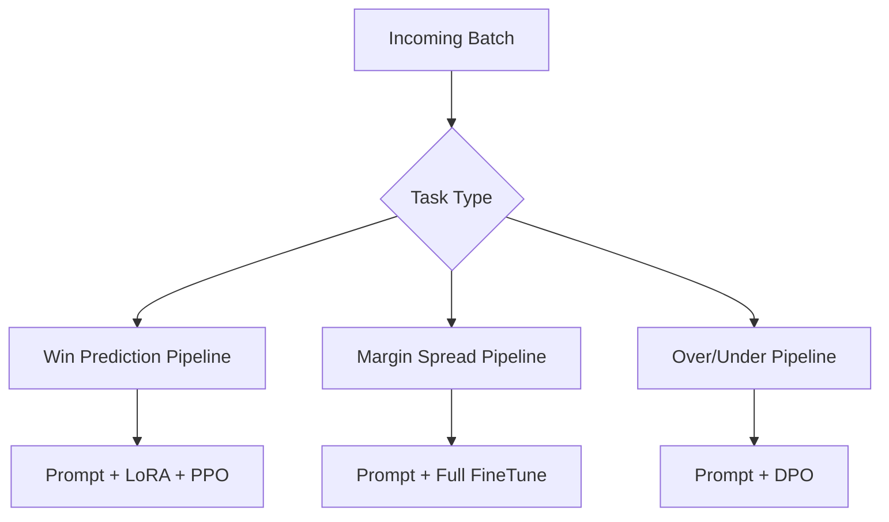
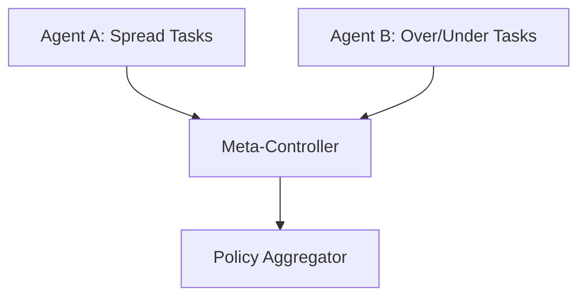
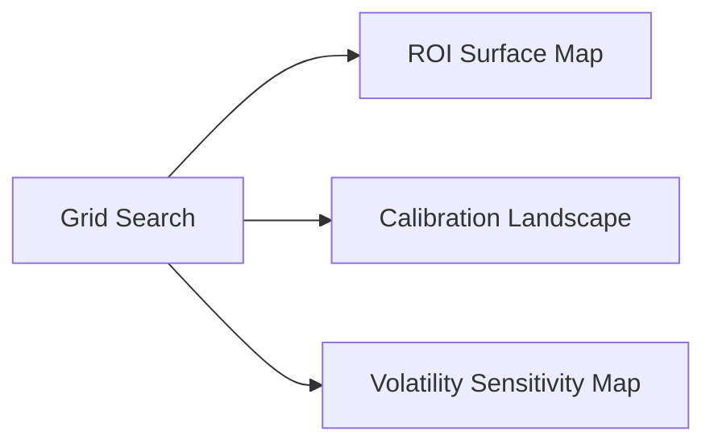

# 🧠 Training Pipeline — From Token to Tensor

> _"Not all training is equal. What matters is relevance, recurrence, and reinforcement."_

This document outlines the training workflow of the VEGAIS Prediction Engine, combining supervised learning, reinforcement signals, and modular deployment logic. All processes are optimized for low-latency inference and real-world reward alignment.

---

## 📦 1. Training Stages Overview

```mermaid
graph TD
    A[Raw Tokenised Tasks] --> B[Prompt Generator]
    B --> C[Supervised Fine-Tuning (SFT)]
    C --> D[Reinforcement Learning (PPO / DPO / GRPO)]
    D --> E[LoRA / QLoRA Adapter Tuning]
    E --> F[Model Compression (Int8 / GPTQ)]
    F --> G[Checkpoints]
    G --> H[Eval Harness (LogLoss / ROI)]
    H -->|score↑| I[Model Promotion]
    H -->|score↓| C
    I --> J[Model Serving Dispatcher]
    J --> K[Edge + Cloud Routing]
```

Each stage in the pipeline targets a specific optimization axis:
- **SFT** aligns the model to labelled historical outcomes
- **RLHF (PPO / DPO / GRPO)** aligns with long-term value functions (ROI)
- **Adapter tuning (LoRA)** keeps updates modular
- **Compression** reduces inference latency without sacrificing performance
- **Eval loop** enforces promotion based on reward-aligned gain
- **Dispatcher** selects optimal serving architecture
- **Routing** balances between edge inference (low-latency) and cloud LLM (high-depth reasoning)

### 1.1 Task Dispatcher & Scheduling Logic
- Incoming task types (e.g., win prediction, over/under) are tagged via classifier heads.
- Each task maps to a pipeline config (prompt + tuning strategy + reward scheme).
- Adaptive sampling increases batch ratio for low-accuracy or high-volatility task types.



---

## 🎯 2. RL Multi-Agent Architectures & Scheduling

### 2.1 Agent Coordination Framework
- Multiple agents trained concurrently on overlapping prediction spaces.
- Policy coordination via actor-critic synchronization and meta-controller.



### 2.2 Token-Budget Aware Scheduler
- Dynamic routing based on:
  - Task urgency
  - Model latency constraints
  - Token quota (edge/cloud budget)
- FIFO+RL hybrid buffer ensures freshness and reward alignment.

---

## ♻️ 3. Online Incremental Learning

- Checkpoints deployed online continue to learn via:
  - Shadow-label match feedback
  - Live bet outcome alignment
- Reservoir sampling maintains historical memory balance.

```math
\text{Update}_{t} = \eta (\hat{y}_{t} - y_{t}) + \lambda R_t
```

---

## ✅ 4. Model Validation, Online Metrics & AutoML

### 4.1 Evaluation Regimes
- **Offline**: Brier score, LogLoss, calibration error
- **Backtest ROI**: Simulation-based policy replay across historical lines
- **Online Shadow Eval**: Parallel inference on live tasks without executing
- **Canary Deployments**: Low-volume test serving to assess reward delta

### 4.2 Parameter Search Visualisation


### 4.3 Drift Detection & Mitigation
- Monitor distribution shifts in input odds + match metadata (KL-divergence threshold)
- Trigger reweighting or replay buffer reselection
- Annotated adversarial examples recycled

### 4.4 AutoML + Policy Search
- Hyperparameter search + reward model tuning
- Multi-objective RL: ROI, risk-adjusted return, long-tail capture
- Strategy ensemble using bandit controller across task variants

---
