# 🧑‍🧬 Training Pipeline — From Token to Tensor

> _"Not all training is equal. What matters is relevance, recurrence, and reinforcement."_

This document outlines the training workflow of the VEGAIS Prediction Engine, combining supervised learning, reinforcement signals, and modular deployment logic. All processes are optimized for low-latency inference and real-world reward alignment.

---

## 📦 1. Training Stages Overview


Each stage targets a specific aspect:
- **SFT** aligns model outputs to labelled prediction targets.
- **RLHF (PPO)** aligns model incentives to real-match outcomes (e.g. ROI, accuracy).
- **LoRA / QLoRA** enables lightweight parameter-efficient refinement.

> 📚 _References:_
> - Schulman et al., "Proximal Policy Optimization Algorithms" (2017)
> - Dettmers et al., "QLoRA: Efficient Finetuning of Quantized LLMs" (ICML 2023)
> - Raffel et al., "Exploring the Limits of Transfer Learning with a Unified Text-to-Text Transformer" (T5)
> - OpenAI, "Fine-Tuning GPT-3 Models" (2022)
> - HuggingFace Blog: https://huggingface.co/blog/rlhf

The above design ensures that the model does not merely memorize token-level correlations but instead generalizes based on high-fidelity data and market-aware feedback. The merged pipeline reduces deployment cost while maintaining inference robustness under distributional shifts.

A diagrammatic breakdown of the full branching merge is provided in Section 7.

---

## 🧪 2. Prompt Construction & Token Policy

### 2.1 Task Templates
| Task Type | Template Format | Example |
|-----------|-----------------|---------|
| Score Win Prediction | Q&A | "Who will win: Team A vs Team B?" → ["Team A"] |
| Spread Betting Margin | Regression | "Predict score difference: A vs B" → ["-4.5"] |
| Over/Under Odds | Classification | "Will total be over 215.5?" → [Yes/No] |

### 2.2 Tokenisation Policy
- SentencePiece + BPE hybrid
- Domain keywords enforced via regex patterns
- Custom token dictionary for rare player/team names

---

## 🤪 3. Curriculum & Feedback Loops


- Rewards include: Prediction ROI, Hit Rate, Long-tail Recall.
- Poor predictions recycled into hard negatives.

### 3.1 Reinforcement Reward Function
Let \( p_{win}, p_{actual} \) be predicted and actual win probabilities, and \( r \) be bet outcome (1 for win, 0 for loss):

\[
\text{Reward} = \lambda_1 \cdot (1 - \text{LogLoss}(p_{win}, p_{actual})) + \lambda_2 \cdot \text{ROI}(r)
\]

Where:
- \( \lambda_1, \lambda_2 \) are tunable weight parameters.
- ROI = (Total Payout - Stake) / Stake.

> 📚 _References:_
> - Christiano et al., "Deep Reinforcement Learning from Human Preferences" (2017)
> - Ouyang et al., "Training language models to follow instructions with human feedback" (InstructGPT, 2022)
> - Google Brain, "Feedback loops in ML: Human + AI co-supervision", 2021


---

## 🌍 4. Multi-Task & Cross-Domain Generalisation

### 4.1 Multi-Task Strategy
- Shared encoder backbone, task-specific heads
- Alternating batches: win/draw/over-under/spread
- Hard examples routed into replay buffer for continued RL training

### 4.2 Cross-Lingual Transfer
- Matches and betting queries in EN, CN, ES via multilingual embedding alignment
- Synthetic translations generated via LLaMA-m2m and filtered by semantic consistency score > 0.9

---

## 🎛️ 5. Multimodal Training & Fusion

- Vision+Text fusion for match highlights, injury detection, form cues
- Audio stream integration (commentary → momentum inference)
- Early fusion via CLIP-style embedding bridge
- Late fusion via MoE gate routing


---

## 🧽 6. RL Training Scheduler

- Dynamic batch shaping (riskier matches more weight)
- On-policy vs off-policy mixture adjusted via Sharpe ratio
- Adaptive reward shaping using momentum decay

```python
def adaptive_weighting(risk, momentum):
    return base_reward * (1 + risk_score * 0.2) * (1 + momentum_decay)
```

---

## 🔁 7. Model Merging & Knowledge Distillation

- Teacher-student pipeline (expert → quantised distilled)
- Merging local LLMs + edge-expert agents using weighted sum:

\[
W_{merged} = \alpha \cdot W_{local} + (1 - \alpha) \cdot W_{expert}
\]

- LayerNorm stats fused post-merge
- MoE policies preserved across branches

### Merging Diagram


---

## ⚙️ 8. Distributed Training Stack

| Layer | Tooling |
|-------|---------|
| Orchestration | Airflow / Flyte / Ray Tune |
| Training Backend | PyTorch Lightning + DeepSpeed |
| Resource Scaling | A100x8 / H100x4 via Kubernetes |
| Logging & Eval | Weights & Biases / Triton Logs |

### 8.1 Example: PPO Fine-Tuning
```python
from trl import PPOTrainer
trainer = PPOTrainer(model, ref_model, tokenizer, config)
trainer.train()
```

---

## 📏 9. Evaluation Harness

- Human-in-the-loop scoring via expert pick reviews
- Statistical Metrics:
  - LogLoss, Brier Score, ROC-AUC
  - ROI Backtest on historical betting scenarios


---

## 🔀 10. Multi​-Strategy RL Fusion & AutoML Controller

### 10.1 Strategy Pool
- **Value​-based** (PPO)
- **Preference​-based** (DPO)
- **Risk​-constrained** (GRPO)

Bandit controller selects strategy per task slice by N​-armed UCB on rolling ROI.

```python
ucb = mu + c * (2*np.log(total)/count)**0.5
```

### 10.2 AutoML Hyper​-Search
- Optuna + W&B sweeps (learning​-rate, λ weights, LoRA​-rank)
- Early stopping on Sharpe@1​-week

### 10.3 Param Search Visual

```mermaid
graph LR
    Search-->ROI[ROI Surface]
    Search-->Cal[Calibration Heatmap]
    Search-->Risk[Risk​-Return Pareto]
```


---

## 📡 11. Data Drift Detection & Self​-Healing

- KL divergence on odds distribution (τ=0.15)
- Population stability index (PSI) on match meta features
- Trigger fast LoRA patch and buffer refresh when drift detected.

---

## 🤖 12. Online Incremental Update & Token​-Budget Scheduler

- Reservoir sampling size = 50k examples
- Token cost guard: if budget <5% remaining, demote low​-risk tasks to next cycle.
