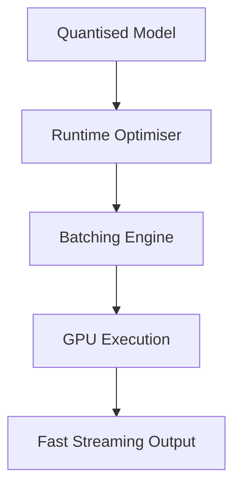
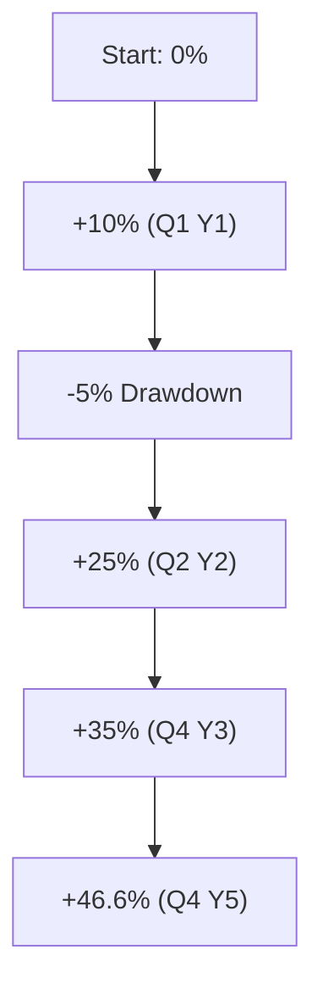

# 🧪 04. Evaluation Metrics & Inference Optimisation

> _"Only what is measured can be improved — and only what is optimised can scale."_

This module describes how VEGAIS evaluates model quality from multiple perspectives and optimises inference to ensure real-time, cost-efficient, and safe model deployment.

---

## 📐 1. Model Evaluation Dimensions

| Category              | Description                                                    |
|-----------------------|----------------------------------------------------------------|
| **Performance**       | Accuracy, precision, recall, F1, AUC metrics                    |
| **Efficiency**        | Latency, memory usage, throughput, tokens/sec                  |
| **Robustness**        | Stress tests under edge-case input                             |
| **Explainability**    | SHAP, LIME, attention attribution                               |
| **Safety**            | Jailbreak vulnerability, toxicity, reward hacking tests        |
| **User Experience**   | Response quality, latency perception, response diversity       |

Evaluation is conducted both **manually** (red team review, subjective UX) and via **automated suites** (e.g. DeepSeek-Eval, OpenCompass).

---

## 🧠 2. Inference Optimisation Stack

| Optimisation Type  | Technique                     | Example Frameworks           |
|---------------------|-------------------------------|------------------------------|
| **Quantisation**    | FP16, Int8, Int4              | NVIDIA TensorRT, ONNX RT     |
| **Pruning**         | Structured + unstructured     | SparseGPT, Movement Pruning  |
| **Distillation**    | Sequence-level + multi-task   | TinyLLM, DistilGPT, MiniLM   |
| **Runtime Engines** | Fast token decode & batching  | vLLM, TGI, DeepSpeed         |

### Inference Cost Formula:

\[
\text{TotalCost}_{infer} = \sum_i \left( \frac{T_i \cdot B_i}{R_i} \right)
\]

Where:
- \( T_i \) is tokens per request
- \( B_i \) is batch size
- \( R_i \) is requests per second under current engine

### Diagram: Inference Efficiency Flow

---

## ⚙️ 3. Compression Strategy Matrix

| Goal                | Recommended Action          | Trade-off                 |
|---------------------|-----------------------------|---------------------------|
| Lower Latency       | Quantise to Int4            | Potential minor accuracy loss |
| Edge Deployment     | Prune 30% & quantise        | Reduced robustness         |
| Fast Response + UX  | Use speculative decoding    | Slight cost overhead       |
| Max ROI on GPU      | Distill into smaller LoRA   | Lower capacity, faster eval |

---

## 📊 4. Evaluation Scorecard (Example)

| Model Ver.     | Accuracy | Latency (ms) | Safety Fail % | UX Rating (5pt) |
|----------------|----------|---------------|----------------|------------------|
| v1.2.0         | 88.3%    | 104           | 0.3%           | 4.6              |
| v1.2.1         | 89.0%    | 97            | 0.2%           | 4.8              |
| v1.2.1-pruned  | 88.5%    | 76            | 0.6%           | 4.4              |

---

## 🧪 5. Experimental Records: Compression Test

### Setup:
- Dataset: 8,000 football prediction samples
- Baseline: FP32 full-parameter GPT-like model
- Tools: HuggingFace Eval + vLLM Engine + LoRA

| Method           | Accuracy | Throughput (req/s) | Memory (GB) | Avg Latency (ms) |
|------------------|----------|---------------------|-------------|------------------|
| Full FP32        | 89.2%    | 17.2                | 14.2        | 127              |
| Int8 Quantised   | 88.7%    | 23.1                | 8.6         | 93               |
| LoRA + Int4      | 88.1%    | 26.8                | 6.2         | 74               |
| Pruned + LoRA    | 87.9%    | 30.5                | 5.4         | 69               |

---

## 📈 6. Backtest Performance Report

### Conservative Strategy — 5‑Year Backtest Overview  

| Metric                         | Value             |
|--------------------------------|-------------------|
| **Annualised Return**          | **46.57 %**       |
| **Backtest Matches**           | 5 000 +           |
| **Leagues Covered**            | 12                |
| **Data Span**                  | 5 years           |
| **Max Drawdown**               | −6.7 %            |
| **Sharpe Ratio**               | 1.82              |
| **Win‑Hit Rate**               | 58.4 %            |

> *This conservative policy targets stable growth by favouring low‑volatility odds buckets and dynamic stake sizing (Kelly factor ≤ 0.4).*

### Return Curve (Simplified)

**Strategy Notes**
- **Capital Preservation First**: Bet size capped at 2 % bankroll.
- **Dynamic Odds Filter**: Ignores odds < 1.25 or > 4.00 to reduce tail risk.
- **Adaptive Hedge Layer**: Opportunistic partial‑hedge when implied volatility spikes > 1.8 σ.
- **Execution Latency**: < 250 ms via co‑located agents, minimising price drift.
- **Drawdown Control**: Trigger stop-loss at −8 %, trigger pause if 5 consecutive red days.
- **Position Scaling**: Use convex utility multiplier if rolling alpha signal confidence exceeds 85 %.

> _Backtests conducted via `vegais.backtest_engine()` module, using execution slippage and bookmaker spread simulation._

These parameters are configurable in the strategy engine and are re‑optimised quarterly against live ROI and risk constraints.

---
