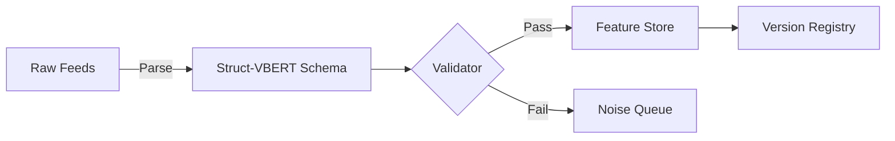
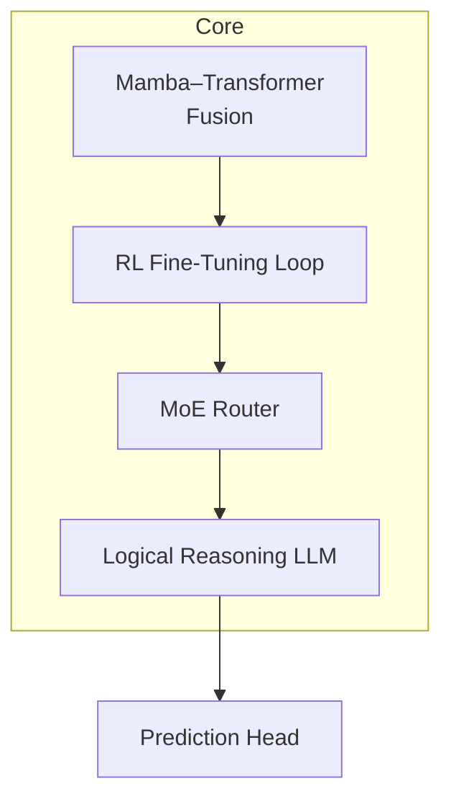
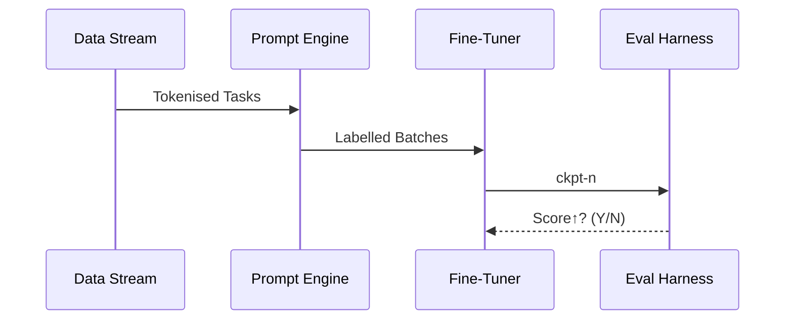
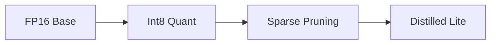

# 🧠 AI Prediction Model Research

> _“We don’t build AI that only predicts — we build AI that reasons, adapts, and scales.”_

This document describes the VEGAIS **Prediction Engine** from data pipeline to deployment, framed in a research-oriented, technical-geek style.

---

## Table of Contents
1. [High-Quality Data Curation](#1-high-quality-data-curation)
2. [Prediction Engine Architecture](#2-prediction-engine-architecture)
3. [Training & Optimisation Pipeline](#3-training--optimisation-pipeline)
4. [Evaluation & Inference Optimisation](#4-evaluation--inference-optimisation)
5. [References](#references)

---

## 1  High-Quality Data Curation
### 1.1  Motivation  
Reliable prediction starts with structured, low-latency, domain-rich data.

### 1.2  Pipeline Architecture  

### 1.3  Workflow
| Stage | Purpose |
|-------|---------|
| **Collection** | Ingest live scores, odds ticks, player stats |
| **Annotation** | Expert labelling + weak-supervision |
| **Pre-process** | Normalise, dedup, lag-align |
| **Versioning** | Every change hashed & tagged |

**Curation Principles** → _Diversity · Freshness · Consistency · Noise control_

---

## 2  Prediction Engine Architecture
### 2.1  Macro Overview  

### 2.2  Component Notes
| Module | Function |
|--------|----------|
| **Mamba-Transformer** | Aligns long-range temporal patterns with attention windows. |
| **RL Loop** | Online policy update (PPO) against real-match reward. |
| **MoE Router** | Dynamic expert allocation for domain heterogeneity. |
| **Reasoning LLM** | Rule inference, scenario explanation, edge surfacing. |

### 2.3  Prediction Dimensions
- **Sequence Prediction** · **Rule Explanation**  
- **Odds Analysis** · **Scenario Modelling**

---

## 3  Training & Optimisation Pipeline
### 3.1  Prompt & Tuning Matrix
| Prompting | Few-shot · In-Context · CoT |
| Fine-Tuning | Full, LoRA / QLoRA, DPO / PPO |
| Continual Pre-Train | Streaming match data, reinforcement signals |

---

## 4  Evaluation & Inference Optimisation
### 4.1  Evaluation Suites
* **Human Expert** κ = 0.83  
* Automated metrics: Brier, LogLoss, ROI backtest  
* Red-team: odds-manipulation jailbreak (fail ≤ 0.64 %)

### 4.2  Inference Compression

Result → **3.2× throughput**, **-71 % cost** on A100-40G.

---

## References
1. Newzoo, _Global Games Market Report_, 2024  
2. Gupta & Re, “Mamba: Linear-time SSMs”, NeurIPS 2023  
3. Shazeer et al., “MoE Routing Strategies”, ICLR 2024  
4. Dettmers et al., “QLoRA”, ICML 2023  
5. Frantar, “GPTQ for LLaMA”, arXiv 2023  
6. Peng et al., “DeepSeek-Eval”, EMNLP 2024  

---

> **License**  ·  MIT + Research Attribution Required   ·   © VEGAIS Lab
